# LibrarianAgent 系统详细设计文档

## RAG + 生成式人工智能服务

---

## 1. 系统概述

### 1.1 项目背景

基于内部知识库构建检索增强型问答系统（RAG），支持中英文双语语料，提供多轮对话能力，并返回带引用的可溯源答案。系统须满足 PRD 中定义的延迟、质量与安全要求。

### 1.2 核心能力

| 能力     | 说明                                                |
| -------- | --------------------------------------------------- |
| 文档摄入 | 支持 TXT/MD/PDF/DOCX 等格式，异步解析、分块、向量化 |
| 向量检索 | 基于 ChromaDB 的语义相似度检索，支持自定义阈值      |
| 多轮对话 | 会话管理 + Query 重写，保持对话上下文连续性         |
| 流式输出 | SSE 实时流式生成，首 token 延迟 < 2s                |
| 监控面板 | 文档统计、查询日志、检索质量指标实时展示            |
| 安全防护 | PII 脱敏、CORS 控制、提示注入基础防御               |

### 1.3 系统截图

**对话界面：**

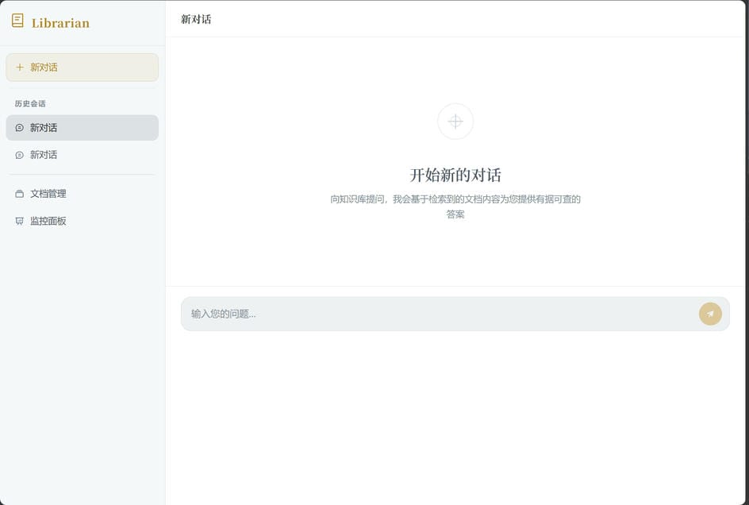

**RAG 检索结果：**

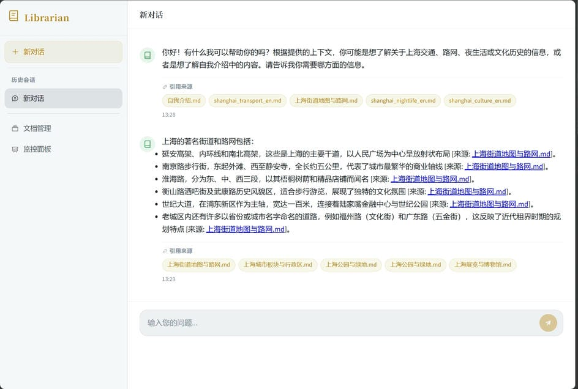

---

## 2. 技术选型

### 2.1 实际技术栈

| 技术组件   | 选型                                | 说明                                                        |
| ---------- |-----------------------------------| ----------------------------------------------------------- |
| 语言/框架  | Java 21 + Spring Boot 3.4.1       | Spring AI 统一抽象层，支持多模型切换                        |
| AI 集成    | Spring AI 1.1.4 (OpenAI 兼容模式)     | 通过 `spring-ai-starter-model-openai` 接入智谱/通义/MiniMax |
| 向量数据库 | ChromaDB (v2 API)                 | Spring AI 原生支持，轻量级本地部署                          |
| 关系数据库 | MySQL 8.x + MyBatis Plus 3.5.7    | 文档元数据持久化、分页查询                                  |
| Embedding  | 云端 API (embedding-3, 512维)        | 通过 OpenAI 兼容接口调用                                    |
| 生成模型   | 云端 API (可配置，默认Qwen3)              | 通过 OpenAI 兼容接口调用                                    |
| 文档解析   | Apache Tika                       | 支持 30+ 格式                                               |
| 前端       | Vue 3 + TypeScript + Element Plus | Vite 构建，Pinia 状态管理                                   |

### 2.2 与 DesignV1 方案对比

| 组件       | DesignV1 方案    | 实际实现               | 取舍原因                                        |
| ---------- | ------------------ | ---------------------- | ----------------------------------------------- |
| 向量数据库 | Milvus 2.4         | ChromaDB               | ChromaDB 轻量、Spring AI 原生支持、开发阶段够用 |
| 会话存储   | Redis              | 内存 ConcurrentHashMap | MVP 阶段无需 Redis，单实例足够                  |
| Embedding  | BGE-M3 本地 (1024维) | 云端 API (512维)       | 免去 GPU 部署，API 调用更便捷                   |
| 生成模型   | Qwen2.5-72B 本地   | 云端 API (OpenAI 兼容) | 免去 GPU 部署，支持多模型热切换                 |
| 重排序     | BGE Reranker-v2-m3 | 未实现                 | V1 阶段 topK=5 + 低阈值检索已满足需求           |
| OCR        | PaddleOCR          | 未实现                 | V1 阶段不处理扫描版 PDF                         |
| 检索策略   | Hybrid (向量 + BM25) | 纯向量检索             | ChromaDB 不支持 BM25，V1 阶段纯向量够用         |

---

## 3. 系统架构

### 3.1 全局架构

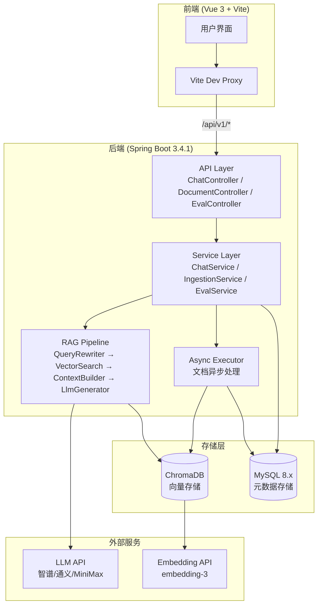
```mermaid
graph TB
    subgraph Frontend["前端 (Vue 3 + Vite)"]
        UI[用户界面]
        Proxy[Vite Dev Proxy]
    end

    subgraph Backend["后端 (Spring Boot 3.4.1)"]
        Controller[API Layer<br/>ChatController / DocumentController / EvalController]
        Service[Service Layer<br/>ChatService / IngestionService / EvalService]
        RAG[RAG Pipeline<br/>QueryRewriter → VectorSearch → ContextBuilder → LlmGenerator]
        Async[Async Executor<br/>文档异步处理]
    end

    subgraph Storage["存储层"]
        Chroma[(ChromaDB<br/>向量存储)]
        MySQL[(MySQL 8.x<br/>元数据存储)]
    end

    subgraph External["外部服务"]
        LLM[LLM API<br/>智谱/通义/MiniMax]
        Embed[Embedding API<br/>embedding-3]
    end

    UI --> Proxy
    Proxy -->|/api/v1/*| Controller
    Controller --> Service
    Service --> RAG
    Service --> Async
    RAG --> Chroma
    RAG --> LLM
    Async --> Chroma
    Async --> MySQL
    Chroma --> Embed
    Service --> MySQL
```

### 3.2 RAG 管道流程

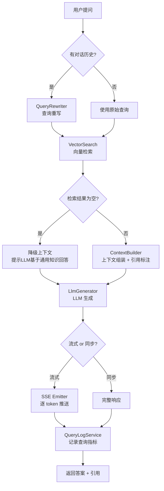
```mermaid
flowchart TD
    A[用户提问] --> B{有对话历史?}
    B -->|是| C[QueryRewriter<br/>查询重写]
    B -->|否| D[使用原始查询]
    C --> E[VectorSearch<br/>向量检索]
    D --> E
    E --> F{检索结果为空?}
    F -->|是| G[降级上下文<br/>提示LLM基于通用知识回答]
    F -->|否| H[ContextBuilder<br/>上下文组装 + 引用标注]
    G --> I[LlmGenerator<br/>LLM 生成]
    H --> I
    I --> J{流式 or 同步?}
    J -->|流式| K[SSE Emitter<br/>逐 token 推送]
    J -->|同步| L[完整响应]
    K --> M[QueryLogService<br/>记录查询指标]
    L --> M
    M --> N[返回答案 + 引用]
```

### 3.3 运行时截图

**应用启动日志：**

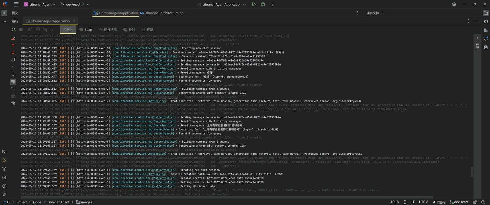

**模型加载日志：**

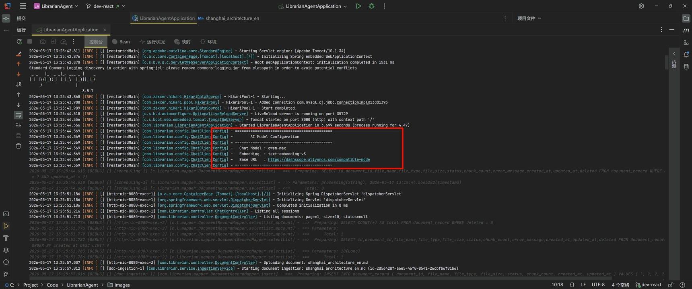

---

## 4. 核心模块设计

### 4.1 文档摄入管道

#### 流程时序图

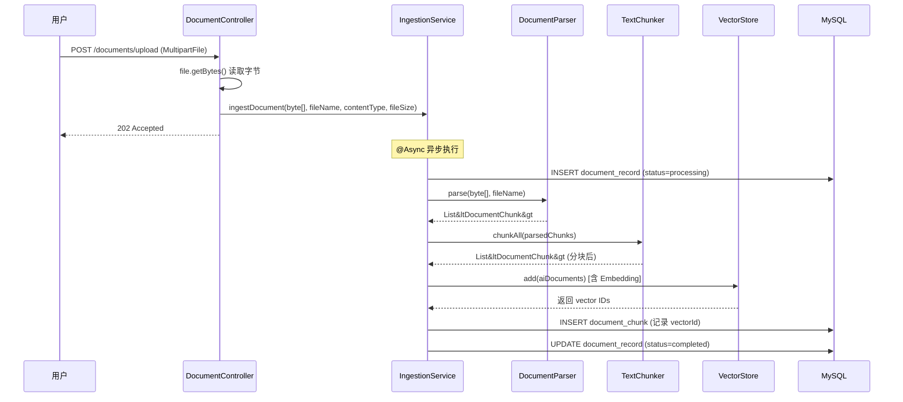
```mermaid
sequenceDiagram
    participant User as 用户
    participant DC as DocumentController
    participant IS as IngestionService
    participant DP as DocumentParser
    participant TC as TextChunker
    participant VS as VectorStore
    participant DB as MySQL

    User->>DC: POST /documents/upload (MultipartFile)
    DC->>DC: file.getBytes() 读取字节
    DC->>IS: ingestDocument(byte[], fileName, contentType, fileSize)
    DC-->>User: 202 Accepted

    Note over IS: @Async 异步执行
    IS->>DB: INSERT document_record (status=processing)
    IS->>DP: parse(byte[], fileName)
    DP-->>IS: List&ltDocumentChunk&gt;
    IS->>TC: chunkAll(parsedChunks)
    TC-->>IS: List&ltDocumentChunk&gt (分块后);
    IS->>VS: add(aiDocuments) [含 Embedding]
    VS-->>IS: 返回 vector IDs
    IS->>DB: INSERT document_chunk (记录 vectorId)
    IS->>DB: UPDATE document_record (status=completed)
```

#### 关键设计决策

1. **@Async + byte[] 传参**：Controller 同步上下文中 `file.getBytes()` 读取字节，将 `byte[]` 传给异步方法，避免 Tomcat 清理临时文件导致 `NoSuchFileException`
2. **Chunk ID 持久化**：每个向量分块记录 `vectorId` 到 `document_chunk` 表，删除文档时精确删除向量，不依赖 similaritySearch
3. **超时自动标记**：`@Scheduled` 定时扫描 processing 超过 10 分钟的文档，标记为 failed
4. **失败重试**：重试时先清理已有向量和 chunk 记录，再重新摄入

#### 文档管理截图

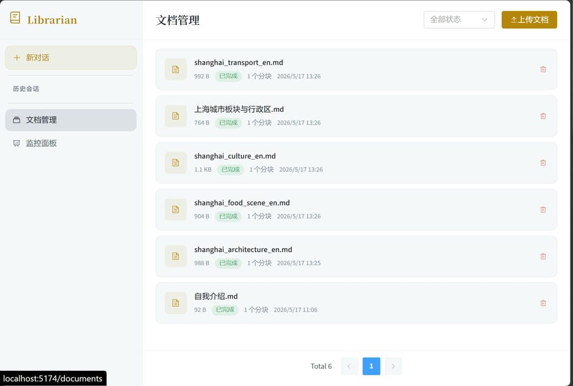

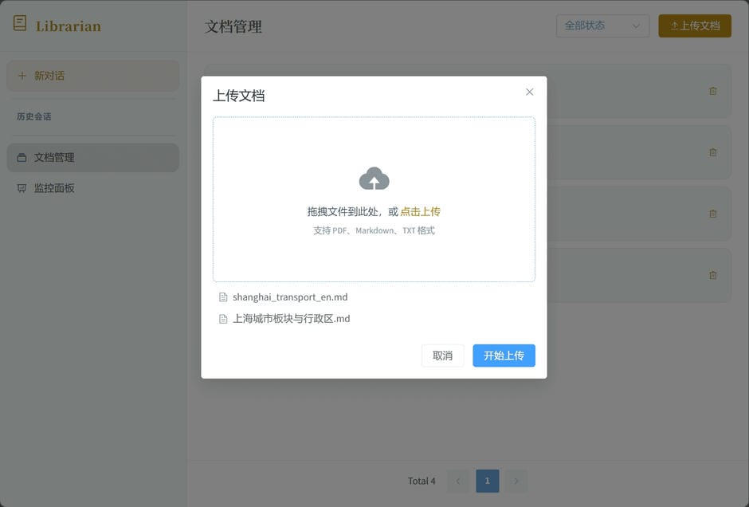

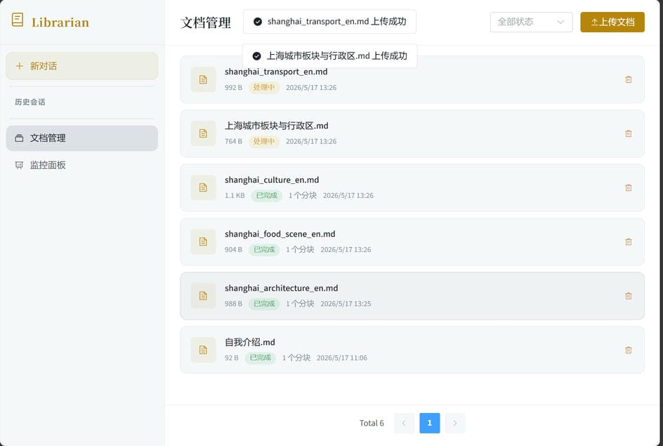

### 4.2 RAG 检索管道

#### 组件职责

| 组件       | 类               | 职责                                                         |
| ---------- | ---------------- | ------------------------------------------------------------ |
| 查询重写   | `QueryRewriter`  | 将多轮对话 + 追问合并为独立检索 query；无历史时直接返回原始 query |
| 向量检索   | `VectorSearch`   | 调用 `VectorStore.similaritySearch()`，支持自定义 topK 和 similarityThreshold |
| 上下文组装 | `ContextBuilder` | 将检索结果格式化为 `[来源N: 文件名]\n内容`，提取引用列表     |
| LLM 生成   | `LlmGenerator`   | 同步 `generate()` 和流式 `generateStream()`，加载 `rag-system-prompt.st` 模板 |

#### 检索阈值策略

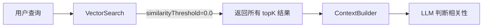
```mermaid
flowchart LR
    A[用户查询] --> B[VectorSearch]
    B -->|similarityThreshold=0.0| C[返回所有 topK 结果]
    C --> D[ContextBuilder]
    D --> E[LLM 判断相关性]
```

**关键决策**：ChatService 中使用 `similarityThreshold=0.0`（不过滤），将相关性判断交给 LLM。原因：Spring AI 的 similarityThreshold 基于向量距离，不同 Embedding 模型的距离分布差异大，硬编码阈值容易过滤掉有效结果。RagProperties 默认值设为 0.3 作为通用场景参考。

#### RAG 检索截图


### 4.3 对话管理

#### 会话模型

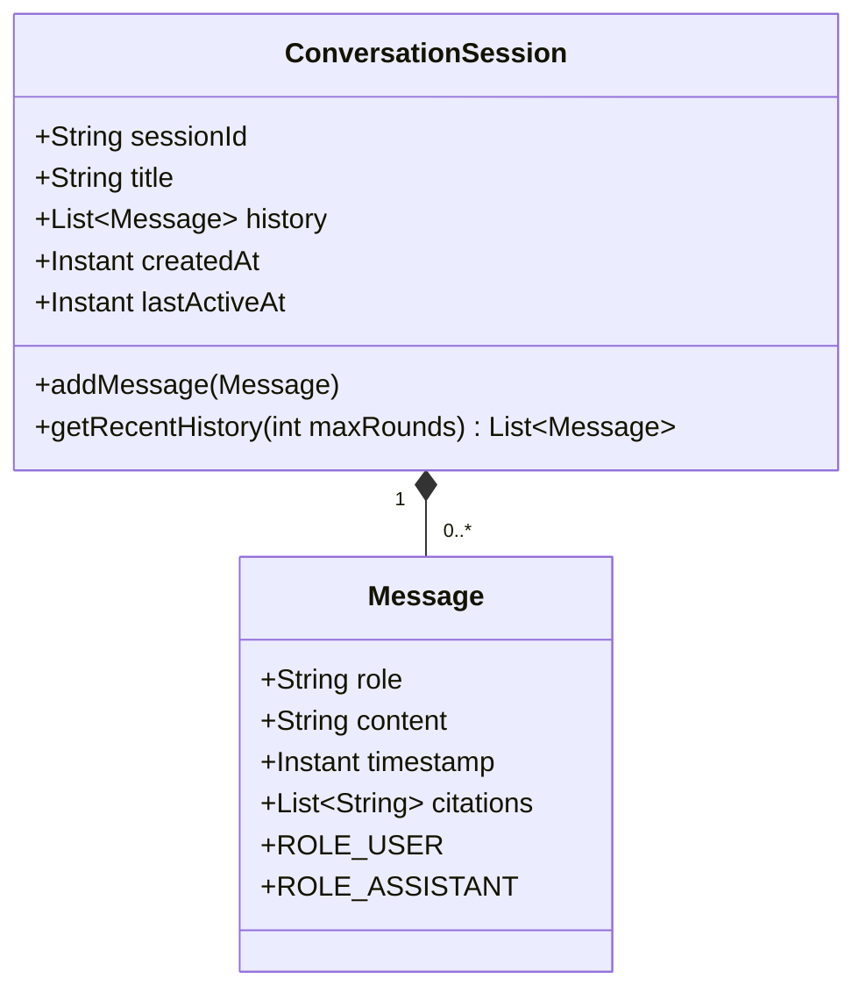
```mermaid
classDiagram
    class ConversationSession {
        +String sessionId
        +String title
        +List~Message~ history
        +Instant createdAt
        +Instant lastActiveAt
        +addMessage(Message)
        +getRecentHistory(int maxRounds) List~Message~
    }

    class Message {
        +String role
        +String content
        +Instant timestamp
        +List~String~ citations
        +ROLE_USER
        +ROLE_ASSISTANT
    }

    ConversationSession "1" *-- "0..*" Message
```

#### 会话生命周期

- **存储**：内存 `ConcurrentHashMap<sessionId, ConversationSession>`
- **过期清理**：`@Scheduled(fixedRate=600000)` 清理 30 分钟无活动的会话
- **历史截断**：`getRecentHistory(maxRounds)` 只取最近 N 轮对话，避免上下文过长

#### SSE 流式输出

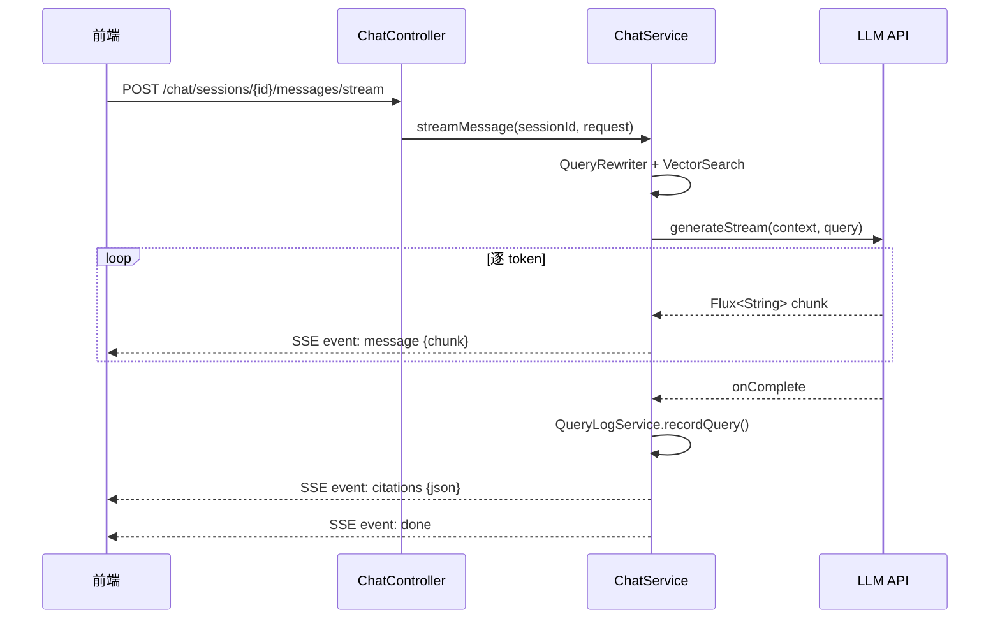
```mermaid
sequenceDiagram
    participant Client as 前端
    participant CC as ChatController
    participant CS as ChatService
    participant LLM as LLM API

    Client->>CC: POST /chat/sessions/{id}/messages/stream
    CC->>CS: streamMessage(sessionId, request)
    CS->>CS: QueryRewriter + VectorSearch
    CS->>LLM: generateStream(context, query)
    loop 逐 token
        LLM-->>CS: Flux<String> chunk
        CS-->>Client: SSE event: message {chunk}
    end
    LLM-->>CS: onComplete
    CS->>CS: QueryLogService.recordQuery()
    CS-->>Client: SSE event: citations {json}
    CS-->>Client: SSE event: done
```

### 4.4 监控面板

#### 数据架构

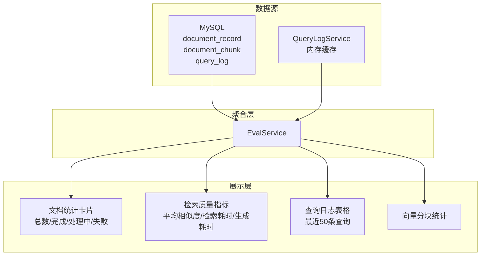
```mermaid
flowchart TD
    subgraph 数据源
        A[MySQL<br/>document_record<br/>document_chunk<br/>query_log]
        B[QueryLogService<br/>内存缓存]
    end

    subgraph 聚合层
        C[EvalService]
    end

    subgraph 展示层
        D[文档统计卡片<br/>总数/完成/处理中/失败]
        E[检索质量指标<br/>平均相似度/检索耗时/生成耗时]
        F[查询日志表格<br/>最近50条查询]
        G[向量分块统计]
    end

    A --> C
    B --> C
    C --> D
    C --> E
    C --> F
    C --> G
```

#### 关键指标

| 指标              | 数据源                  | 计算方式                  |
| ----------------- | ----------------------- | ------------------------- |
| 文档总数/各状态数 | MySQL `document_record` | `GROUP BY status` 聚合    |
| 向量分块总数      | MySQL `document_chunk`  | `SELECT COUNT(*)`         |
| 平均相似度        | MySQL `query_log`       | `AVG(avg_similarity)`     |
| 平均检索耗时      | MySQL `query_log`       | `AVG(retrieval_time_ms)`  |
| 平均生成耗时      | MySQL `query_log`       | `AVG(generation_time_ms)` |
| 总查询数          | MySQL `query_log`       | `COUNT(*)`                |
| 最近查询日志      | 内存缓存 + MySQL 兜底   | 最近 50 条                |

#### 监控面板截图

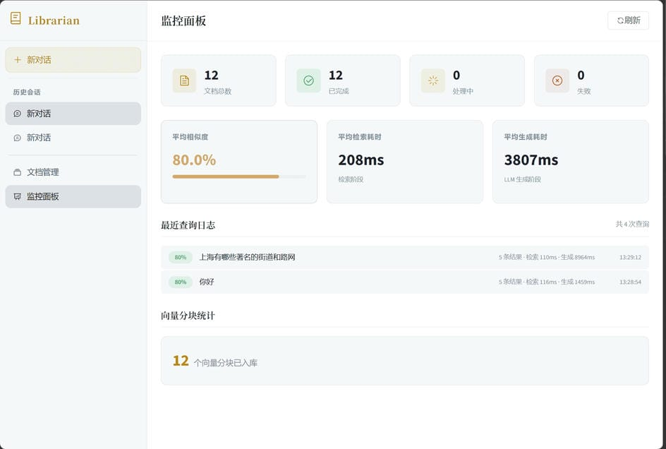

---

## 5. 数据模型

### 5.1 ER 关系图

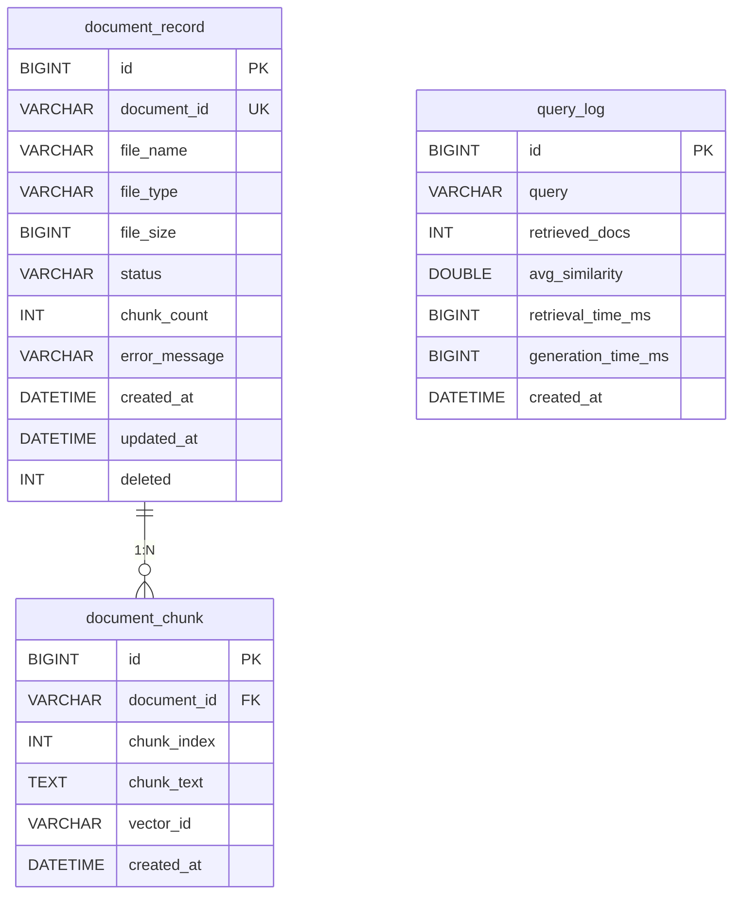
```mermaid
erDiagram
    document_record {
        BIGINT id PK
        VARCHAR document_id UK
        VARCHAR file_name
        VARCHAR file_type
        BIGINT file_size
        VARCHAR status
        INT chunk_count
        VARCHAR error_message
        DATETIME created_at
        DATETIME updated_at
        INT deleted
    }

    document_chunk {
        BIGINT id PK
        VARCHAR document_id FK
        INT chunk_index
        TEXT chunk_text
        VARCHAR vector_id
        DATETIME created_at
    }

    query_log {
        BIGINT id PK
        VARCHAR query
        INT retrieved_docs
        DOUBLE avg_similarity
        BIGINT retrieval_time_ms
        BIGINT generation_time_ms
        DATETIME created_at
    }

    document_record ||--o{ document_chunk : "1:N"
```

### 5.2 ChromaDB 集合结构

| 属性           | 值                 |
| -------------- | ------------------ |
| 集合名         | `librarian-docs`   |
| Tenant         | `SpringAiTenant`   |
| Database       | `SpringAiDatabase` |
| Embedding 维度 | 512                |
| 距离函数       | Cosine             |

**文档元数据字段：**

| 字段         | 类型   | 说明              |
| ------------ | ------ | ----------------- |
| `fileName`   | String | 来源文件名        |
| `fileType`   | String | 文件 MIME 类型    |
| `documentId` | String | 关联的文档记录 ID |

### 5.3 数据库截图

**MySQL 数据库：**

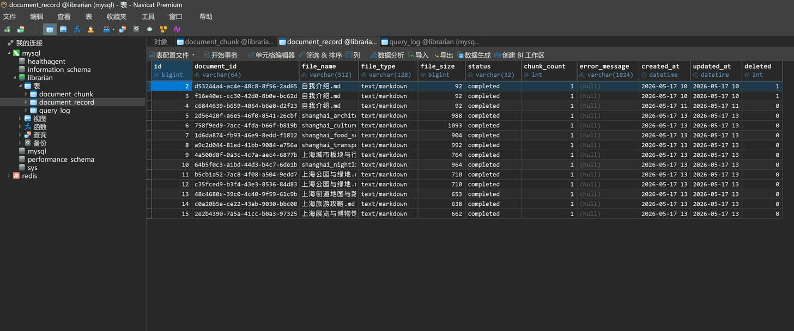

**ChromaDB 数据库：**


---

## 6. API 接口设计

### 6.1 对话接口

| 方法 | 路径                                         | 说明             |
| ---- | -------------------------------------------- | ---------------- |
| POST | `/api/v1/chat/sessions`                      | 创建会话         |
| GET  | `/api/v1/chat/sessions`                      | 列出所有会话     |
| GET  | `/api/v1/chat/sessions/{id}`                 | 获取会话及消息   |
| POST | `/api/v1/chat/sessions/{id}/messages`        | 同步发送消息     |
| POST | `/api/v1/chat/sessions/{id}/messages/stream` | SSE 流式发送消息 |

### 6.2 文档管理接口

| 方法   | 路径                                       | 说明                            |
| ------ | ------------------------------------------ | ------------------------------- |
| POST   | `/api/v1/documents/upload`                 | 上传文档（multipart/form-data） |
| GET    | `/api/v1/documents?page=1&size=10&status=` | 分页查询文档列表                |
| GET    | `/api/v1/documents/{documentId}`           | 获取文档详情                    |
| DELETE | `/api/v1/documents/{documentId}`           | 删除文档（含向量清理）          |
| POST   | `/api/v1/documents/{documentId}/retry`     | 重试失败的文档                  |

### 6.3 监控接口

| 方法 | 路径                     | 说明             |
| ---- | ------------------------ | ---------------- |
| GET  | `/api/v1/eval/dashboard` | 获取监控面板数据 |

**Dashboard 响应结构：**

```json
{
  "documentStats": {
    "totalDocuments": 10,
    "completedDocuments": 8,
    "processingDocuments": 1,
    "failedDocuments": 1,
    "totalChunks": 45
  },
  "recentQueries": [
    {
      "query": "上海有哪些公园",
      "retrievedDocs": 5,
      "avgSimilarity": 0.72,
      "retrievalTimeMs": 320,
      "generationTimeMs": 2800,
      "timestamp": "2026-05-17T10:30:00Z"
    }
  ],
  "retrievalMetrics": {
    "avgSimilarity": 0.68,
    "avgRetrievalTimeMs": 290,
    "avgGenerationTimeMs": 2500,
    "totalQueries": 42
  }
}
```

---

## 7. 前端架构

### 7.1 技术栈

| 技术         | 版本 | 用途           |
| ------------ | ---- | -------------- |
| Vue          | 3.x  | 响应式 UI 框架 |
| TypeScript   | 5.x  | 类型安全       |
| Element Plus | 最新 | UI 组件库      |
| Pinia        | 最新 | 状态管理       |
| Vue Router   | 4.x  | 路由           |
| Vite         | 5.x  | 构建工具       |
| Axios        | 最新 | HTTP 客户端    |

### 7.2 页面路由与组件结构

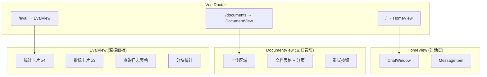
```mermaid
flowchart TD
    subgraph Router["Vue Router"]
        R1["/ → HomeView"]
        R2["/documents → DocumentView"]
        R3["/eval → EvalView"]
    end

    subgraph HomeView["HomeView (对话页)"]
        CW[ChatWindow]
        MI[MessageItem]
    end

    subgraph DocumentView["DocumentView (文档管理)"]
        UL[上传区域]
        DT[文档表格 + 分页]
        RB[重试按钮]
    end

    subgraph EvalView["EvalView (监控面板)"]
        SC[统计卡片 x4]
        MC[指标卡片 x3]
        QL[查询日志表格]
        CS[分块统计]
    end

    R1 --> CW
    R2 --> UL
    R3 --> SC
```

### 7.3 状态管理

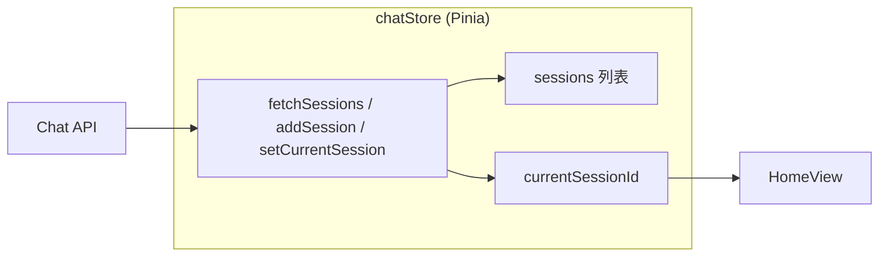
```mermaid
flowchart LR
    subgraph PiniaStore["chatStore (Pinia)"]
        Sessions[sessions 列表]
        Current[currentSessionId]
        Actions[fetchSessions / addSession / setCurrentSession]
    end

    API[Chat API] --> Actions
    Actions --> Sessions
    Actions --> Current
    Current --> HomeView
```

### 7.4 Vite 代理配置

前端通过 Vite Dev Server 代理将 `/api` 请求转发到后端 `localhost:8080`，开发环境无需处理跨域：

```typescript
server: {
  proxy: {
    '/api': {
      target: 'http://localhost:8080',
      changeOrigin: true,
    },
  },
}
```

---

## 8. 部署架构

### 8.1 开发环境

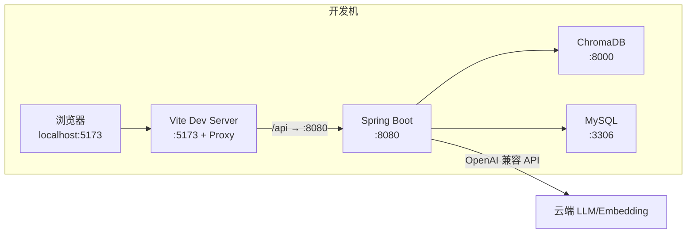
```mermaid
graph LR
    subgraph 开发机
        Browser[浏览器<br/>localhost:5173]
        Vite[Vite Dev Server<br/>:5173 + Proxy]
        Spring[Spring Boot<br/>:8080]
        Chroma[ChromaDB<br/>:8000]
        MySQL[MySQL<br/>:3306]
    end

    Browser --> Vite
    Vite -->|/api → :8080| Spring
    Spring --> Chroma
    Spring --> MySQL
    Spring -->|OpenAI 兼容 API| Cloud[云端 LLM/Embedding]
```

### 8.2 开发环境截图

**Trae IDE：**

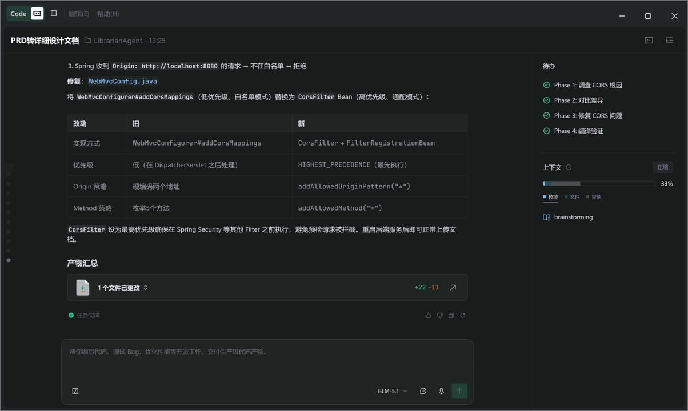

**IntelliJ IDEA：**

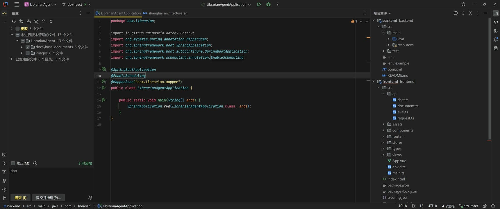

### 8.3 环境配置

| 配置项         | 环境变量                  | 默认值                   |
| -------------- | ------------------------- | ------------------------ |
| 服务端口       | `SERVER_PORT`             | 8080                     |
| MySQL URL      | `MYSQL_URL`               | localhost:3306/librarian |
| MySQL 用户     | `MYSQL_USER`              | root                     |
| MySQL 密码     | `MYSQL_PASSWORD`          | 123456                   |
| AI Base URL    | `AI_OPENAI_BASE_URL`      | -                        |
| AI API Key     | `AI_API_KEY`              | -                        |
| Chat 模型      | `AI_CHAT_MODEL`           | -                        |
| Embedding 模型 | `AI_EMBEDDING_MODEL`      | embedding-3              |
| Embedding 维度 | `AI_EMBEDDING_DIMENSIONS` | 512                      |
| ChromaDB Host  | `CHROMA_HOST`             | http://localhost         |
| ChromaDB Port  | `CHROMA_PORT`             | 8000                     |

---

## 9. 安全设计

### 9.1 CORS 配置

使用 `CorsFilter`（最高优先级）替代 `WebMvcConfigurer#addCorsMappings`，避免 Vite 代理 `changeOrigin: true` 导致的 Origin 不匹配问题：

| 配置项            | 值                   |
| ----------------- | -------------------- |
| 匹配路径          | `/api/**`            |
| 允许 Origin       | `*`（通配）          |
| 允许 Method       | `*`（全部）          |
| 允许 Header       | `*`（全部）          |
| Allow Credentials | true                 |
| Max Age           | 3600s                |
| Filter 优先级     | `HIGHEST_PRECEDENCE` |

### 9.2 PII 脱敏

`PiiSanitizer` 对输入和输出进行正则匹配脱敏：

| PII 类型 | 检测正则                                         | 脱敏替换     |
| -------- | ------------------------------------------------ | ------------ |
| 邮箱     | `[a-zA-Z0-9._%+-]+@[a-zA-Z0-9.-]+\.[a-zA-Z]{2,}` | `[邮箱]`     |
| 手机号   | `1[3-9]\d{9}`                                    | `[电话]`     |
| 身份证号 | `\d{17}[0-9Xx]`                                  | `[身份证号]` |

### 9.3 提示注入防御

- 系统提示与用户内容通过 Spring AI 的 `system()` / `user()` 分离，不拼接
- 检索上下文作为独立参数注入，不参与系统提示拼接
- LLM 系统提示中明确要求"答案必须严格基于提供的上下文"

---

## 10. 运维与可观测性

### 10.1 日志格式

```
%d{yyyy-MM-dd HH:mm:ss.SSS} [%-5level] [%X{traceId}] [%thread] [%logger{50}] - %msg%n
```

- 每个请求通过 `X-Request-Id` 头或自动生成的 `traceId` 串联
- `LoggerUtil.setRequestId()` 在 Controller 层设置 MDC traceId

### 10.2 关键日志事件

| 事件         | 级别  | 内容                      |
| ------------ | ----- | ------------------------- |
| 文档上传     | INFO  | 文件名、documentId        |
| 文档摄入完成 | INFO  | documentId、chunk 数量    |
| 文档摄入失败 | ERROR | documentId、异常信息      |
| 查询重写     | INFO  | 原始 query → 重写后 query |
| 向量检索     | DEBUG | 检索耗时、结果数          |
| LLM 生成     | DEBUG | 生成耗时                  |
| 会话清理     | INFO  | 清理的过期会话数          |
| 超时文档标记 | WARN  | 超时的 documentId         |

### 10.3 监控指标

通过 `QueryLogService` 持久化到 MySQL `query_log` 表，由 `EvalService` 聚合计算：

| 指标         | 计算方式                  | 用途           |
| ------------ | ------------------------- | -------------- |
| 平均相似度   | `AVG(avg_similarity)`     | 检索质量趋势   |
| 平均检索耗时 | `AVG(retrieval_time_ms)`  | 向量数据库性能 |
| 平均生成耗时 | `AVG(generation_time_ms)` | LLM 性能       |
| 总查询数     | `COUNT(*)`                | 系统使用量     |
| 文档状态分布 | `GROUP BY status`         | 摄入管道健康度 |

---

*文档版本：v2.0 | 生成时间：2026-05-17 | 基于 LibrarianAgent 实际实现*
